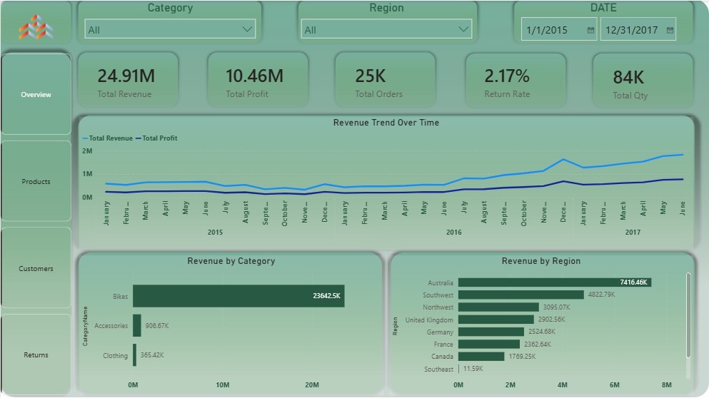
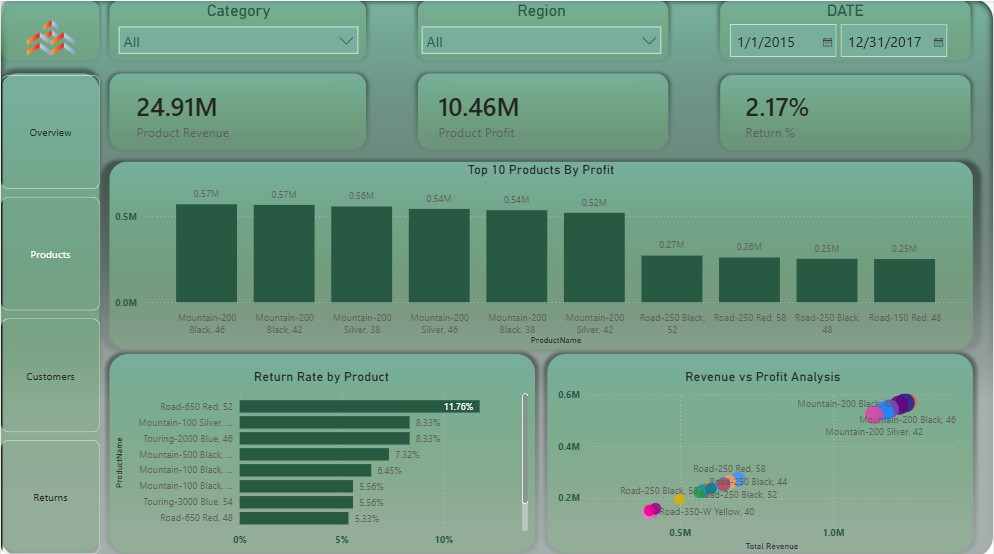
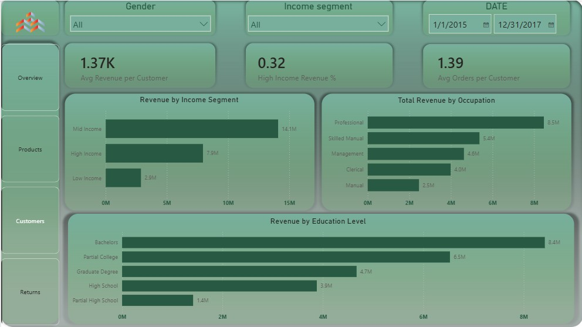
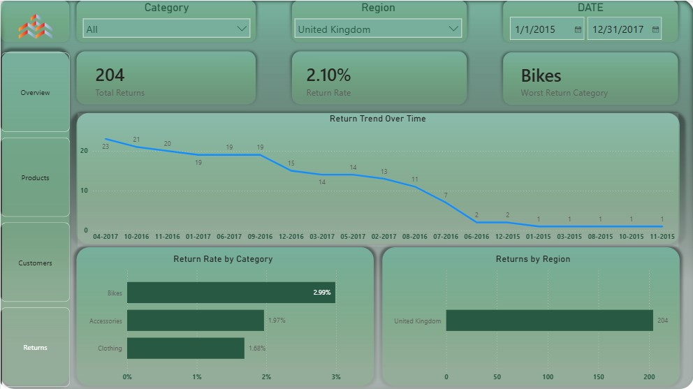

# AdventureWorks Power BI Dashboard

## Project Overview
This project analyzes AdventureWorks sales data using Power BI to track revenue, profit, orders, returns, product performance, customer behavior, and regional sales trends.

## Tools Used
- Power BI
- DAX
- Power Query
- Data Modeling

## Key Business Metrics
- Total Revenue
- Total Profit
- Total Orders
- Total Quantity
- Return Rate
- Average Revenue per Customer

## Dashboard Pages
1. Overview Page
   - Revenue trend over time
   - Revenue by category
   - Revenue by region

2. Products Page
   - Top products by profit
   - Revenue vs profit analysis
   - Return rate by product

3. Customers Page
   - Revenue by income segment
   - Average revenue per customer
   - Customer-level analysis

4. Returns Page
   - Total returns
   - Return rate
   - Return trends and product return analysis

## Key Insights
- Bikes generated the highest revenue among product categories.
- Australia and Southwest regions contributed strongly to total revenue.
- Revenue and profit showed an upward trend from 2015 to 2017.
- Some product categories existed in the dimension table but had no matching sales transactions, which was validated during slicer and filter testing.

## Data Modeling
The model follows a star-schema style approach with Sales as the main fact table and Products, Customers, Date, Territory, and Product Category tables as dimensions.

## Screenshots

### Overview

### Products

### Customers

### Returns

## What I Learned
- Building relationships between fact and dimension tables
- Creating DAX measures for cards
- Handling slicer/filter context issues
- Validating blank results caused by missing fact table records
- Designing a multi-page Power BI dashboard
